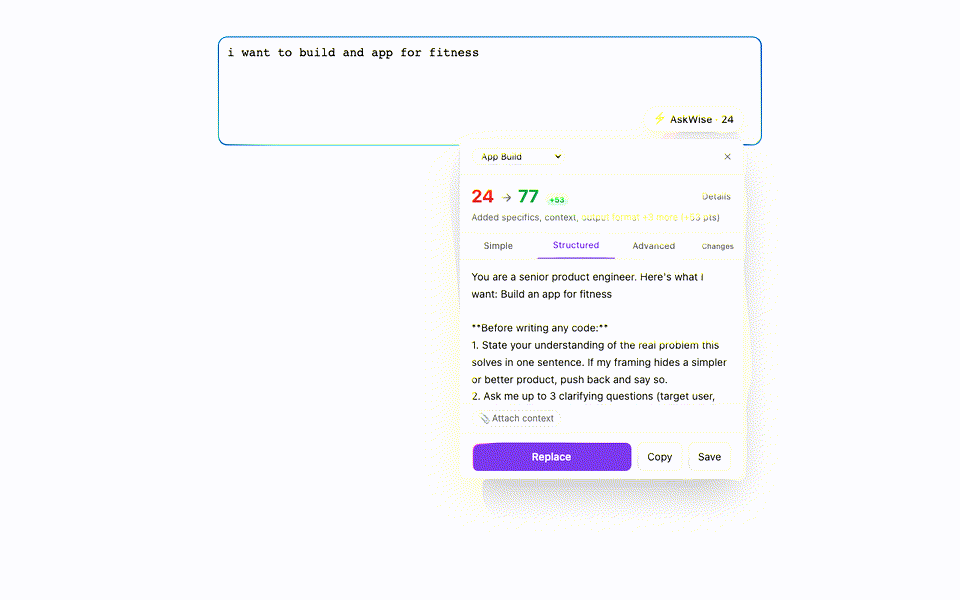

# ⚡ AskWise

**Grammarly for AI prompts.** A free, open-source Chrome extension that turns rough prompts
into structured, model-ready prompts — on ChatGPT, Claude, Gemini, Perplexity, DeepSeek,
and Copilot. Everything runs on your device.



Type `"i want to build and app for fitness"` → get a spec-style prompt with a role, scope
questions, milestones, and acceptance criteria — plus a before/after quality score that
teaches you *why* it's better.

Regenerate store screenshots + this GIF: `npm run capture:assets`

## Why it's different

- **Local-first, actually.** Classification, templates, and scoring are plain local code.
  Advanced rewrites use a built-in on-device model (WebLLM / WebGPU, ~1 GB, auto-downloads
  on install), then optional Ollama/LM Studio or your own API key. No server, no account,
  no telemetry. See [PRIVACY.md](PRIVACY.md).
- **An intent classifier, not a text expander.** A rule engine (100% on gated fixtures)
  routes your prompt to one of 9 modes and 36+ specialized sub-recipes (ATS resume checks,
  salary negotiation, slow-query debugging, cold outreach, …).
- **Explainable scoring.** The 0–100 score is a deterministic rubric (task clarity,
  specificity, context, format, constraints…) — not LLM vibes. The diff view shows exactly
  what was added.
- **Quality is tested.** `npm run eval` runs every fixture through
  classify → rewrite → score and gates on accuracy; add `--judge` to have a local LLM grade
  rewrite quality 1–10.

## Install

**From source (2 minutes):**

```bash
git clone <this repo> && cd AskWise
npm install
npm run build
```

Then: `chrome://extensions` → enable **Developer mode** → **Load unpacked** → select `dist/`.
Visit chatgpt.com, type a prompt (8+ characters), click the **⚡ Improve** pill.

**Chrome Web Store:** coming soon.

## On-device AI for Advanced rewrites

The instant (Tier 1) rewrites work offline forever. For LLM-powered Advanced rewrites,
AskWise downloads a small instruct model (~1 GB, Qwen2.5 1.5B by default) into the browser
on install and runs it locally via WebGPU (Chrome 109+). No Ollama required.

**Optional upgrade — larger local models via Ollama:**

1. Install [Ollama](https://ollama.com) → `ollama pull qwen3:8b`
2. Set `OLLAMA_ORIGINS=chrome-extension://*` (environment variable) and restart Ollama
3. AskWise options → **Test connection**

Or paste your own Anthropic/OpenAI key (BYOK) — secrets are redacted locally before any call.

## Development

```bash
npm run dev       # Vite dev server (fixture pages at /tests/fixtures/)
npm test          # Unit tests (Vitest) — includes the 290+ fixture classifier gate
npm run eval      # Quality report: classification accuracy + rewrite score lift
npm run eval -- --judge   # + local LLM judges rewrite quality 1-10 (needs Ollama)
npm run test:e2e       # E2E / smoke tests (Playwright)
npm run capture:assets # Store screenshots (1280×800) + docs/assets/demo.gif
npm run build          # Production build → dist/
npm run zip            # Build + askwise-<version>.zip for Web Store upload
```

Pre-ship checklist: [docs/smoke-checklist.md](docs/smoke-checklist.md) · Store copy: [docs/store-listing.md](docs/store-listing.md)

### Architecture in 30 seconds

```
content script (per site adapter)
  └─ widget (Shadow DOM React app)
       ├─ classify (regex rules)  ──────────── instant, local
       ├─ sub-recipes + recipes (templates) ── instant, local
       ├─ score (deterministic rubric) ─────── instant, local
       └─ messages ─→ service worker
                        └─ Tier 2 LLM ladder: on-device WebLLM → Ollama → BYOK → Tier 1
```

Key directories: `src/shared/` (classify, score, recipes, sub-recipe packs — all pure and
unit-tested), `src/content/` (adapters + widget), `src/background/` (router, LLM providers),
`tests/fixtures/prompts.json` (the classifier exam).

## Contributing

The highest-leverage contribution is **a template pack** — ~10 minutes, no build knowledge
needed. See [CONTRIBUTING.md](CONTRIBUTING.md). Fixture contributions (real prompts people
type) are a close second.

## Keyboard shortcut

`Alt+I` — open the improver for the focused composer.

## License

[MIT](LICENSE)
